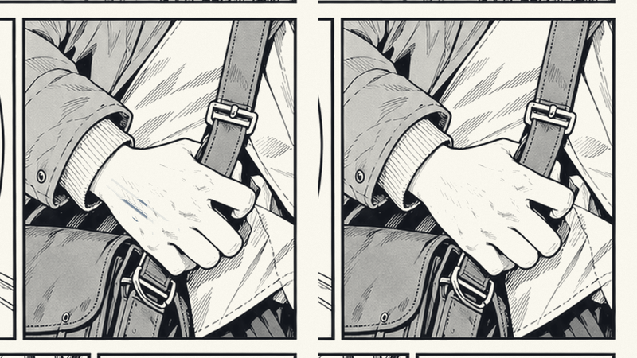
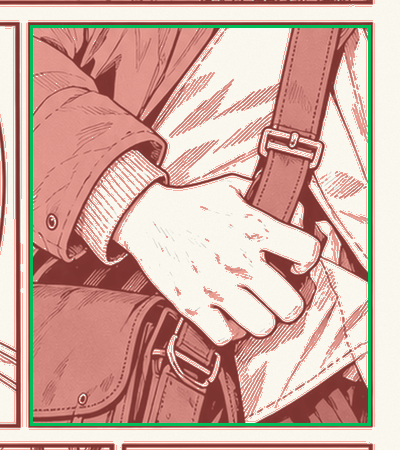

# 0.8.2 追加調整 — 基本報酬・無料消し片・漫画の手元

基準コミット: `3cf6182`。作業ブランチ: `fb-0.8.2`。External Test 01のタグ・Release・ZIPは対象外。

## 全Runtime依頼の基本報酬

仕上がり・紙保護・スピード等のボーナス式、評価、消しカス売却単価は変更しない。そのため最終受取総額は単純な半額にはならない。5本チャレンジは既存の基本報酬参照式のため、新基本報酬から計算される。DEV_PIPELINE_001は開発専用なので対象外。

|ID|依頼名|旧基本報酬|新基本報酬|
|---|---|---:|---:|
|corrections|丁寧な修正|2,400円|1,200円|
|draft|大量の鉛筆跡|1,800円|900円|
|TEST_001|机に置いてあった紙|800円|400円|
|TEST_002|一文字だけ、お願いします|1,600円|800円|
|TEST_003|締切は昨日でした|2,600円|1,300円|
|TEST_004|母のレシピ|2,400円|1,200円|
|TEST_005|誰にも見せない名前|1,900円|950円|
|TEST_006|100点じゃ困るんです|2,200円|1,100円|
|TEST_007|渡さなかった手紙|1,400円|700円|
|TEST_008|全部消して構いません|2,100円|1,050円|
|child|子どもの落書き|1,000円|500円|
|pattern|包装紙の下書き|1,400円|700円|
|letter|手紙の書き損じ|1,000円|500円|
|close-letter|詰まった宛名の一文字|1,700円|850円|
|color-doodle|色鉛筆の落書き|1,600円|800円|
|extra-stroke|文字の余分な一画|2,100円|1,050円|
|large-study|画用紙いっぱいの下描き|2,200円|1,100円|
|manga|漫画原稿の下描き|2,300円|1,150円|
|old-letter|古い手紙の追記|2,100円|1,050円|
|ruled-margin|斜め罫線のはみ出し|1,700円|850円|
|childs-gift|子どもの力作|1,900円|950円|
|exam-corrections|答案の書き直し|2,000円|1,000円|
|giant-doodle|集会所の巨大落書き|2,300円|1,150円|
|late-manga|漫画家の修羅場|2,600円|1,300円|
|named-remainder|誰にも見せない名前|1,600円|800円|
|recipe-notes|古いレシピノート|2,200円|1,100円|
|shop-banner|商店街の看板下書き|1,700円|850円|
|unsent-letter|渡さなかった手紙|1,300円|650円|

## 格安消しゴム片

お金がない時にも仕事を続けられる最低保証。ただし有料道具の代わりを無条件に務めるものではなく、消えにくさと短い寿命によって交換の手間を残す。ランダム個体差や自動補充は追加しない。1回のクリックで1個受け取り、別の個体IDを持つ。

|項目|旧|新|
|---|---:|---:|
|価格|90円|0円|
|消去力|0.62|0.40|
|接触半径の基準値|0.25|0.20|
|入手時残量（基準倍率）|100%|35%|
|入手時角Sharpness|100%|30%|
|本体摩耗率|0.75|0.90|
|角摩耗率|0.050|0.065|
|長尺成長補正|2.15|0.60|
|まとまり|1.00|0.50|
|カス生成量倍率|1.50|0.65|
|紙ダメージ倍率|0.14|0.14（維持）|
|本体容量|60|60（維持）|

新しい説明文：

> 使い古しをちぎった小さな消しゴム片。無料でどうぞ。消えにくく、角も丸く、すぐ減ります。何個か受け取って、交換しながら使ってください。

Lv0の基準倍率では残り21容量、摩耗0.90なので約23.3world単位の接触移動で尽きる。残量の計算は既存の容量補正を利用し、摩耗軽減スキルは従来通り寿命へ反映される。角は丸い状態から始まり、使うほど既存下限へ摩耗する。小型化しても角の精密性は丸みで制限される。

`initialRemaining`と`initialSharpness`をEraserDefinitionに追加し、ToolInventory.Addが定義から個体初期状態を作る。通常商品は既定値1なので従来通り新品。既に所持する個体は再初期化しない。保存・Retryの既存スナップショットを利用する。価格0は決済をスキップし、負価格は拒否する。Walletの支出ルールは変更しない。受け取りで現金や消しカスを生成しない。実際に消した黒鉛だけが副収入になる既存条件も維持。

従来の全道具消耗時の貸出救済は今回変更していない。無料消し片はショップから任意に複数確保できる経路として追加。無料の代償がどの程度効くか、既存貸出との比較は人間テスト対象。

他商品の価格・性能は基準コミットのアセットハッシュで一致確認。なおこのチェックアウトの高級製図消しの実データは7,800円。前回資料にある50,000円表記と相違するが、今回「他価格不変」の指示に従って実データを維持した。

## TEST_003の局所緩和

制作原本2480×3508の中央右コマ、x=1640..2320、y=1030..1830のErasableのみ除去。手の甲・指・ベルトの密集部分を消去対象から外した。除いた対象は旧全体量の約3.1%。完成線・ProtectMask・Paper・CompletePreviewは基準とバイト一致。見える黒線への接触を無効にしていない。

顔のアタリなど他コマの精密部分、吹き出し・空・アクション余白の広い下書きは維持。中央右は完成線を鑑賞するコマとして残し、他コマで面・辺・角を使う。

既存EditorのJob PreviewでもTEST_003を選んでComposite/EraseMask/ProtectMaskを比較できる。上の切り抜きはTools/Feedback082/Adjustment/preview.pyで再生成可能。元のアート再生成はTools/ExternalArt/generate.py --jobs 3。

## 実装箇所

- Runtime JobDefinitionアセット全28件、External用JSON元データ8件、旧依頼生成Setup3種。
- BudgetSoftEraser.asset、Text ID台帳、EraserDefinition、EraserState、ToolInventory、ShopHUD。
- TEST_003のErasable/EraseMask/InitialPreview、manifestとQAストローク。
- Feedback082AdjustmentChecks、baseline.json、preview.py。既存テスト中の旧格安最強・有料必須という期待のみ新仕様へ更新し、チェックを削除しない。

## 次の人間テスト

1. 漫画中央右の手元を消す必要がなくなり、残る精密部分が適量か。
2. 報酬の基本部分だけ半額にしたことで、ボーナス・消しカスの相対価値が適切か。
3. 無料片で詰まずに遊べるが、有料の普通消しへ戻りたくなるか。
4. 交換頻度が適切か。複数片の選択が面倒すぎないか。
5. 小さい面積・丸い角・低い長尺適性が説明から理解できるか。

## 検証結果

[検証結果](Verification.md)：追加130件、合計2,113件成功・0件失敗。通常版／Development版ビルド成功。自動チェックは操作感を保証するものではない。
